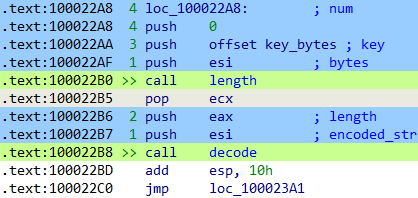

# IDAPython scripts

## `color.py` :art:

It colors `call`, `push` and `pop` instructions (sets background color).
It also adds the prefix `>>` to`call` instructions and the number of argument to its parameters (only available if the function declaration is defined).
This is useful to quickly identify function calls, their parameters and the calling convention.

## `uncolor.py`

It removes the background color of all the database.
It can be used to remove the colors added by `color.py`.
It doesn't remove the prefixes thought.

## `RC4.py`

It inspect the whole code looking for instructions like `mov register, offset`.
It tries to decode the bytes which start at the `offset` address using RC4.
If the result is a printable string, it adds a comment in that location with the decoded string and prints a message to the output window with the decoded string and the address.

## `resolve-apis.py`

It can be use to decode the apis used by a program which resolves API calls at runtime using hashing.

## `print-debug.py`

It includes several functions which can be used in conditional breakpoints for debugging purposes.

## `copy-strings.py`

It adds two actions to the strings windows:
- With `Ctrl+C` it copies the strings or list of strings selected.
  The default is to copy the whole row/s.
- With `Ctrl+P` it prints the address and the string in the output window.

